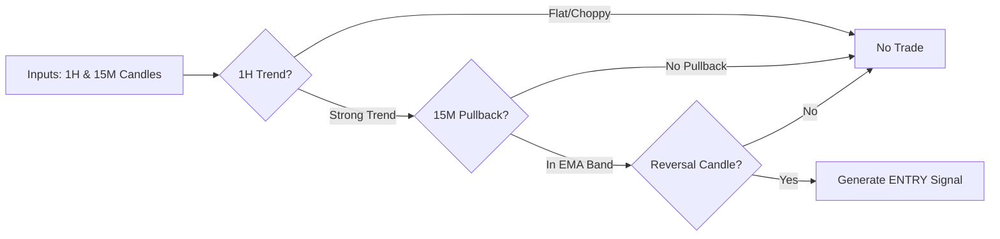

# Rare Candy 💎 - System Architecture

## Pseudocode Flow (`main.py`)

```python
# The "Wurmple" Infinite Loop
while True:
    1.  FETCH State:
        - Equity = Coinbase.get_balance()
        - Positions = Coinbase.get_positions()
        - Logs -> "dashboard/status.json" (Telemetry)

    2.  FOR EACH Symbol (BTC, ETH):
        - Data = Coinbase.get_candles(1H, 15m)
        
        # --- STRATEGY LAYER ---
        - Signal = Strategy.evaluate(Data)
        # -> Returns: "Buy BTC @ $65k" OR None

        if Signal:
            # --- RISK LAYER ---
            - Decision = RiskManager.evaluate(Signal, Equity)
            # -> Checks: 
            #    1. Is Day Loss > 5%? (Killswitch)
            #    2. Is Position Size > 20%? (Sizing)
            # -> Returns: "Approved: Buy 0.12 BTC" OR "Blocked"

            if Decision.Approved:
                 # --- EXECUTION LAYER ---
                 - Coinbase.place_order(Market, Size)
                 - Log "Trade Executed"
    
    3.  SLEEP 15 minutes
```

## Logic Diagram

```mermaid
graph TD
    subgraph "External World"
        CB[Coinbase API]
        WU[Wurmple (Remote AI)]
    end

    subgraph "Rare Candy Engine (VPS)"
        
        subgraph "Op Loop (main.py)"
            TICK[Tick (15m)] --> DATA[Data Pipeline]
        end

        DATA -- Fetch Candles --> CB
        CB -- OHLCV --> DATA
        DATA --> STRAT[Strategy Engine]

        STRAT -- Analyze Logic --> SIG{Signal?}
        
        SIG -- No --> SLEEP[Wait]
        SIG -- Yes --> RISK[Risk Manager]

        RISK -- Check Rules --> DEC{Approved?}
        
        DEC -- No (Block) --> LOG[Log Reason]
        DEC -- Yes --> EXEC[Execution Adapter]

        EXEC -- Place Order --> CB
        
        subgraph "Telemetry"
            STATE[status.json]
        end
        
        RISK -. Update State .-> STATE
        EXEC -. Log Trade .-> STATE
    end

    STATE -- Read HTTP --> WU
```

## Strategy Logic (Trend Pullback)


